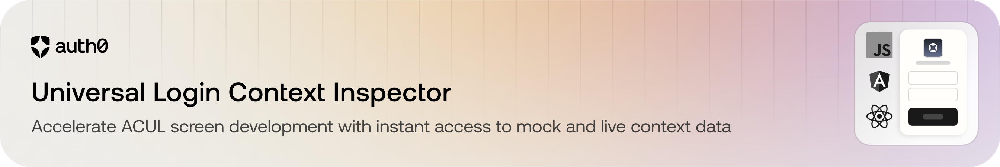

# Auth0 Universal Login Context Inspector
<p align="center">
  
</p>

<p align="center">
  <a href="https://www.npmjs.com/package/@auth0/ul-context-inspector"></a>
  <a href="https://www.npmjs.com/package/@auth0/ul-context-inspector"></a>
  
  
  
  
  

</p>


Developer panel for inspecting and previewing the Universal Login JSON context (`window.universal_login_context`) for the Advanced Customizations for Universal Login (ACUL) feature.

---

## ✅ What It Does
1. Detects if a real tenant context exists ("connected" mode).  
2. If not, lets you preview screens & variants using a local or CDN manifest ("disconnected" mode).  
3. Lets you inspect & live-edit mock context JSON (broadcasts a custom event).  
4. Persists your selections (screen / variant / data source / version) in `sessionStorage` between reloads.

---

## 📦 1. Install

```bash
npm install @auth0/ul-context-inspector
```

Peer dependencies (install if you don’t already have them):
```bash
npm install react react-dom
```
---

## 🗂 2. Local Manifest & Variant Files

When the panel runs in disconnected mode it attempts to fetch a local manifest at `GET /manifest.json`:

- If the request succeeds (HTTP 200), the data source switches to "Local development" automatically.
- If it fails, the panel defaults to the Auth0 CDN manifest.

Place your manifest and variant JSON under `public/` so Vite (or your bundler) serves them from the root:

```
public/
  manifest.json
  screens/
    login/
      login/
        default.json
        with-errors.json
    login-id/
      login-id/
        default.json
        with-errors.json
```

### Manifest Shape
`manifest.json` contains an array `screens` with objects mapping `prompt` → `screen` → variant node:

```jsonc
{
  "screens": [
    {
      "login": {
        "login": { "path": "/screens/login/login", "variants": ["default", "with-errors"] }
      }
    },
    {
      "login-id": {
        "login-id": { "path": "/screens/login-id/login-id", "variants": ["default", "with-errors"] }
      }
    }
  ]
}
```

Each variant file is loaded at: `<path>/<variant>.json` (e.g. `/screens/login/login/default.json`).

If a node omits `variants`, the panel assumes a single `default` variant.

---

## 🧪 3. Mount the Panel

```tsx
import { UniversalLoginContextPanel } from '@auth0/ul-context-inspector';

export function App() {
  return <UniversalLoginContextPanel defaultScreen="login:login" />;
}
```

`defaultScreen` uses `prompt:screen` format. If omitted and CDN mode is active, the panel may auto-select a common screen (e.g. `login-id:login-id`).

---

## 4. Subscribe to Context Updates (Optional)

Use the subscription hook if your host needs to re-render on context changes:

```tsx
import { useUniversalLoginContextSubscription } from '@auth0/ul-context-inspector';

function Host() {
  const context = useUniversalLoginContextSubscription();
  return <pre>{JSON.stringify(context?.screen, null, 2)}</pre>;
}
```


## 🕹 5. Interactive Behavior

- Connected mode: If `window.universal_login_context` existed at mount, selections do not override real tenant context screen/variant.
- Disconnected mode: Screen & variant selection reloads the page to simulate host SDK remount.
- Persistence: Values stored in `sessionStorage` with prefix `ulci:`.
- Local manifest auto-detection runs once at startup; if found, data source switches to Local.
- Editing JSON: Writes directly to `window.universal_login_context` (even in mock mode) and triggers a broadcast event.

---

## 🧩 Panel Props

| Prop | Type | Default | Description |
|------|------|---------|-------------|
| `defaultScreen` | `string` | `undefined` | Initial preview screen (`prompt:screen`) if no prior session selection. |

---

## 🎨 Styling Notes

Tailwind classes are prefixed with `uci-`. If you purge CSS, safelist with a regex like `/uci-/`.

---

## 🛠 Development
```bash
npm install
npm run dev      # Start dev server
npm run build    # Produce dist (JS, types, CSS)
```

---

## 🧾 License

Apache-2.0

---

## ❓ FAQ

**Why is my local manifest ignored?**  
Ensure `public/manifest.json` returns 200 and matches the shape above; check dev tools Network panel.

**How do I force CDN mode?**  
Delete/rename local `manifest.json` or manually switch data source in the panel.
